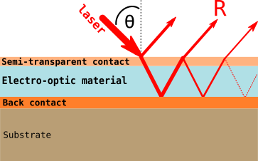
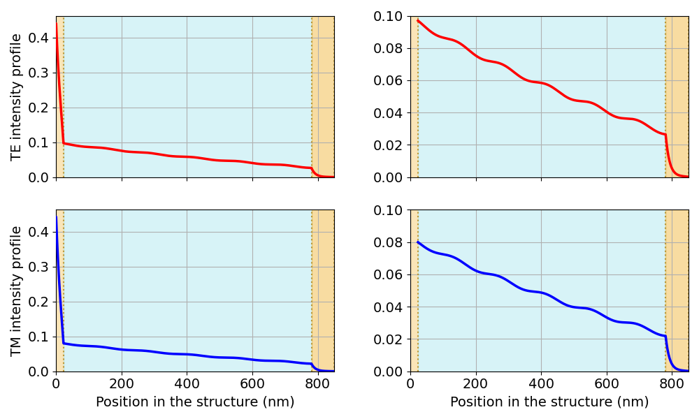

# Electro-Optic Coefficients Calculation (PyEOC)
Implementation of the method published by Cuniot-Ponsard et al. in JAP 109, 014107 (2011) [https://doi.org/10.1063/1.3514083](https://doi.org/10.1063/1.3514083)

Pr. Sidi Hamady  
Université de Lorraine, France  
sidi.hamady@univ-lorraine.fr  
Released under the MIT license (https://opensource.org/licenses/MIT)  
See Copyright Notice in COPYRIGHT  
Reference: [Sidi Ould Saad Hamady, "PyEOC: a Python Code for Determining Electro-Optic Coefficients of Thin-Film Materials", arXiv:2205.05157, 2022](https://doi.org/10.48550/arXiv.2205.05157).

## Presentation and Requirements

PyEOC calculates the electro-optic coefficients of an optical material by implementing the method published by Cuniot-Ponsard et al. in JAP 109, 014107 (2011) [https://doi.org/10.1063/1.3514083](https://doi.org/10.1063/1.3514083).
  
  
  
 **Figure 1.** The standard multilayer structure used to measure the electro-optic (and converse piezoelectric) coefficients of a thin-film material. The film to characterize is sandwiched between two thin metallic contacts (*e.g.* gold, platinum): a semi-transparent top contact and a thick bottom contact. The voltage is applied between these two contacts and the reflectance measured with respect to the incident angle Θ.  
  
  
 **Figure 2.** Intensity variation with the position in the Pt/SBN/Pt structure in both TE and TM polarization. The figures on the right represent a zoom in the active layer.  
  
  
 **Figure 3.** Experimental and theoretical calculated static reflectivity R (top-left), dynamic reflectivity ΔR (bottom-left) and the calculated TE derivatives (right). The symbols indicate the experimental data curves and the lines indicate the fitted curves.  
  
  
To install PyEOC:  
just download it from github: [https://github.com/sidihamady/PyEOC](https://github.com/sidihamady/PyEOC)  
unzip and use.  
You can also install the PyEOC module to use as usually done in Python:  
```
python3 setup.py install 
```

The distribution mainly includes:  

Three main Python files:  
* [PyEOC.py](PyEOC.py) implementing the program core functionality in the module classe.  
* [tmmCore.py](tmmCore.py) S J Byrnes' transfer-matrix-method code ([https://pypi.python.org/pypi/tmm](https://pypi.python.org/pypi/tmm) -- [https://arxiv.org/abs/1603.02720](https://arxiv.org/abs/1603.02720))  
* [Test.py](Test.py) an example with a SBN structure by Cuniot-Ponsard et al. in JAP 109, 014107 (2011)  

The basic requirements are found in any Linux distribution (and easily installed for Windows):
* Python version 2.7.x or later
* numpy version 1.5 or later
* scipy version 0.13.1 or later
* matplotlib version 1.3.x or later

PS: for Windows, you can download a complete Python distribution from [https://www.anaconda.com/distribution/](https://www.anaconda.com/distribution/)

## HowTo

You can use the included Test.py and adapt it to your needs:    

```
# -*- coding: utf-8 -*-

import sys, os
#sys.path.insert(0, "/path/to/PyEOC")
from PyEOC import *     # import PyEOC core class

Structure = PyEOC(
    'SBN',  # structure name included in the PyEOC class
    # measurement data: static  reflectivity vs angle (TE and TM)
    #                   dynamic reflectivity vs angle (TE and TM)
    #                   four files with tab-separated columns
    # 'SBN' data extracted from Cuniot-Ponsard et al. in JAP 109, 014107 (2011)
    'SBN_Reflectivity_TE.txt',      'SBN_Reflectivity_TM.txt',
    'SBN_Reflectivity_Dyn_TE.txt',  'SBN_Reflectivity_Dyn_TM.txt'
)

Structure.wavelength = 633  # laser wavelength in nm
Structure.voltage = 1.0     # applied voltage amplitude in volts

# the incident angle theta starting three values and range
# the choosen theta values should correspond to a "smooth" and "different" part of the DR and delta_R / delta_? data
Structure.theta_manual  = [35.0 * Structure.toradian, 40.0 * Structure.toradian, 45.0 * Structure.toradian]
Structure.thetaDelta    =   2.0 * Structure.toradian
Structure.thetaStart    =  30.0 * Structure.toradian
Structure.thetaEnd      =  70.0 * Structure.toradian

Structure.thickness[1] =  22.6  # Pt thickness (nm)
Structure.thickness[2] = 758    # SBN thickness (nm)
Structure.refractiveindexo[2] = 2.30 + 0.0515624j
Structure.refractiveindexe[2] = 2.26 + 0.0515624j

Structure.fit_dynamic = True    # fit the dynamic reflectivity?
Structure.fit(report = True)    # start fitting and report
Structure.plot()                # plot the fitted curves
#Structure.plotpoynting()        # plot the intensity profile

```
